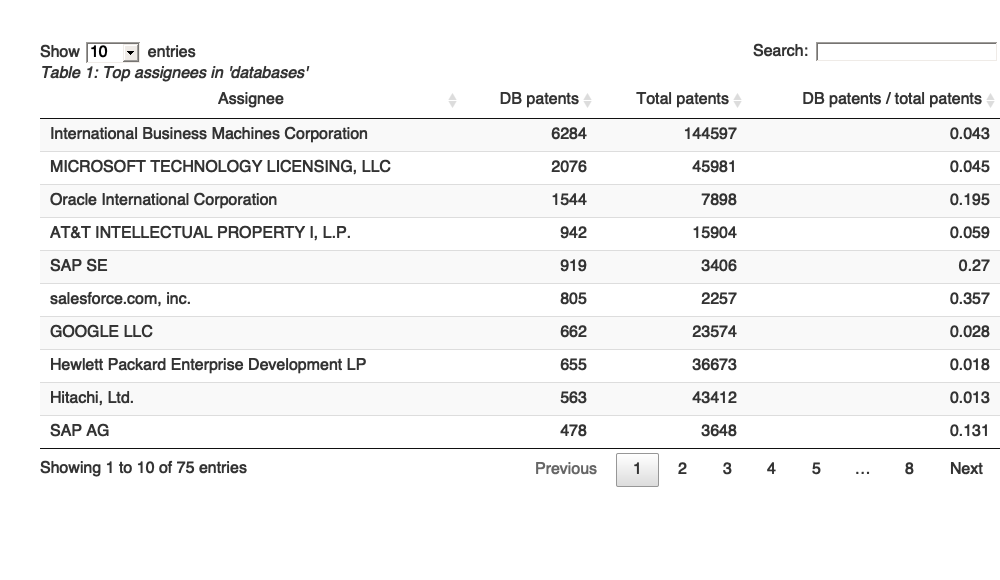
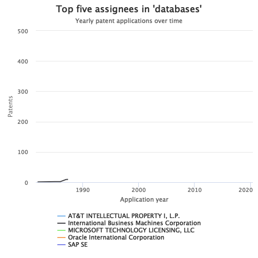
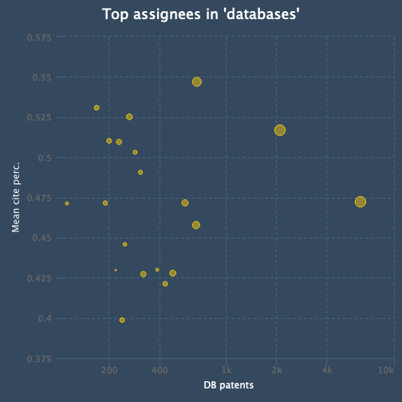

The following is a quick analysis of the top organizations patenting in the field of databases.

1. The first step is to download the relevant data fields from the PatentsView API:


```r
library(patentsview)
library(dplyr)
library(highcharter)
library(DT)
library(knitr)

# We first need to write a query. Our query will look for "database" in either 
# the patent title or abstract...Note, this isn't a terribly good way to ID our 
# patents, but it will work for the purpose of demonstration. Users who are 
# interested in writing higher-quality queries could consult the large body of 
# research that has been done in field of patent document retrieval.
query <- with_qfuns(
  or(
    text_phrase(patent_abstract = "database"),
    text_phrase(patent_title = "database")
  )
)

query
#> {"_or":[{"_text_phrase":{"patent_abstract":"database"}},{"_text_phrase":{"patent_title":"database"}}]}

# Create a list of the fields we'll need for the analysis
fields <- c(
  "patent_number", "assignee_organization",
  "patent_num_cited_by_us_patents", "app_date", "patent_date",
  "assignee_total_num_patents"
)

# Send an HTTP request to the PatentsView API to get the data
pv_out <- search_pv(query, fields = fields, all_pages = TRUE)
```

2. Now let's identify who the top assignees are based on how many patents they have in our data set. We'll also calculate how many total patents these assignees have and what fraction of their total patents relate to databases.


```r
# Unnest the data frames that are stored in the assignee list column
dl <- unnest_pv_data(pv_out$data, "patent_number")
dl
#> List of 3
#>  $ assignees   :'data.frame':	67574 obs. of  4 variables:
#>   ..$ patent_number             : chr [1:67574] "10000911" ...
#>   ..$ assignee_organization     : chr [1:67574] "DOOSAN INFRACORE CO., LTD." ...
#>   ..$ assignee_total_num_patents: chr [1:67574] "189" ...
#>   ..$ assignee_key_id           : chr [1:67574] "10886" ...
#>  $ applications:'data.frame':	66655 obs. of  3 variables:
#>   ..$ patent_number: chr [1:66655] "10000911" ...
#>   ..$ app_date     : chr [1:66655] "2014-12-05" ...
#>   ..$ app_id       : chr [1:66655] "15/101707" ...
#>  $ patents     :'data.frame':	66655 obs. of  3 variables:
#>   ..$ patent_number                 : chr [1:66655] "10000911" ...
#>   ..$ patent_num_cited_by_us_patents: chr [1:66655] "0" ...
#>   ..$ patent_date                   : chr [1:66655] "2018-06-19" ...

# Create a data frame with the top 75 assignees:
top_asgns <-
  dl$assignees %>%
    filter(!is.na(assignee_organization)) %>% # some patents are assigned to an inventor (not an org)
    mutate(ttl_pats = as.numeric(assignee_total_num_patents)) %>%
    group_by(assignee_organization, ttl_pats) %>% 
    summarise(db_pats = n()) %>% 
    mutate(frac_db_pats = round(db_pats / ttl_pats, 3)) %>%
    ungroup() %>%
    select(c(1, 3, 2, 4)) %>%
    arrange(desc(db_pats)) %>%
    slice(1:75)

# Create datatable
datatable(
  data = top_asgns,
  rownames = FALSE,
  colnames = c(
    "Assignee", "DB patents","Total patents", "DB patents / total patents"
  ),
  caption = htmltools::tags$caption(
    style = 'caption-side: top; text-align: left; font-style: italic;',
    "Table 1: Top assignees in 'databases'"
  ),
  options = list(pageLength = 10)
)
```



<br>

IBM is far and away the biggest player in the field. However, we can see that Oracle and Salesforce.com are relatively more interested in this area, as indicated by the fraction of their patents that relate to databases.

3. Let's see how these assignees' level of investment in databases has changed over time.


```r
# Create a data frame with patent counts by application year for each assignee
data <- 
  top_asgns %>%
    select(-contains("pats")) %>%
    slice(1:5) %>%
    inner_join(dl$assignees) %>%
    inner_join(dl$applications) %>%
    mutate(app_yr = as.numeric(substr(app_date, 1, 4))) %>%
    group_by(assignee_organization, app_yr) %>%
    count() 

# Plot the data using highchartr:
hchart(
  data, "line", 
  hcaes(x = app_yr, y = n, group = assignee_organization)
) %>%
  hc_plotOptions(series = list(marker = list(enabled = FALSE))) %>%
  hc_xAxis(title = list(text = "Application year")) %>%
  hc_yAxis(title = list(text = "Patents")) %>%
  hc_title(text = "Top five assignees in 'databases'") %>%
  hc_subtitle(text = "Yearly patent applications over time")
```



It's hard to see any clear trends in this graph. What is clear is that the top assignees have all been patenting in the field for many years.

4. Finally, let's see how the organizations compare in terms of their citation rates. First, we'll need to normalize the raw citation counts by publication year, so that older patents don't have an unfair advantage over younger patents (i.e., because they have had a longer time to accumulate citations).


```r
# Write a ranking function that will be used to rank patents by their citation counts
percent_rank2 <- function(x)
  (rank(x, ties.method = "average", na.last = "keep") - 1) / (sum(!is.na(x)) - 1)

# Create a data frame with normalized citation rates and stats from Step 2
asng_p_dat <-
  dl$patents %>%
    mutate(patent_yr = substr(patent_date, 1, 4)) %>%
    group_by(patent_yr) %>%
    mutate(perc_cite = percent_rank2(patent_num_cited_by_us_patents)) %>%
    inner_join(dl$assignees) %>%
    group_by(assignee_organization) %>%
    summarise(mean_perc = mean(perc_cite)) %>%
    inner_join(top_asgns) %>%
    arrange(desc(ttl_pats)) %>%
    filter(!is.na(assignee_organization)) %>%
    slice(1:20) %>%
    mutate(color = "#f1c40f") %>%
    as.data.frame()

kable(head(asng_p_dat), row.names = FALSE)
```


|assignee_organization                       | mean_perc| db_pats| ttl_pats| frac_db_pats|color   |
|:-------------------------------------------|---------:|-------:|--------:|------------:|:-------|
|International Business Machines Corporation | 0.4725093|    6284|   144597|        0.043|#f1c40f |
|Samsung Electronics Co., Ltd                | 0.4301865|     384|    98404|        0.004|#f1c40f |
|Canon Kabushiki Kaisha                      | 0.4299559|     217|    78447|        0.003|#f1c40f |
|SONY CORPORATION                            | 0.4214531|     429|    55766|        0.008|#f1c40f |
|Kabushiki Kaisha Toshiba                    | 0.4460499|     246|    52964|        0.005|#f1c40f |
|General Electric Company                    | 0.4908506|     305|    48821|        0.006|#f1c40f |

Now let's visualize the data. Each assignee will be represented by a point/bubble. The x-value of the point will represent the total number of patents the assignee has published in the field of databases (on a log scale), while the y-value will represent its average normalized citation rate. The size of the bubble will be proportional to the percent of the assignee's patents that relate to databases.


```r
# Adapted from http://jkunst.com/highcharter/showcase.html
hchart(
  asng_p_dat, "scatter", 
  hcaes(x = db_pats, y = mean_perc, size = frac_db_pats, 
        group = assignee_organization, color = color)
) %>%
  hc_xAxis(
    title = list(text = "DB patents"), type = "logarithmic",
    allowDecimals = FALSE, endOnTick = TRUE
  ) %>%
  hc_yAxis(title = list(text = "Mean cite perc.")) %>%
  hc_title(text = "Top assignees in 'databases'") %>%
  hc_add_theme(hc_theme_flatdark()) %>%
  hc_tooltip(
    useHTML = TRUE, pointFormat = tooltip_table(
    x = c("DB patents", "Mean cite percentile", "Fraction DB patents"),
    y = c("{point.db_pats:.0f}","{point.mean_perc:.2f}", "{point.frac_db_pats:.3f}")
  )) %>%
  hc_legend(enabled = FALSE)
```



<br>

It looks like Microsoft has relatively high values across all three three metrics (average citation percentile, number of database patents, and percent of total patents that are related to databases). IBM has more patents than Microsoft, but also has a lower average citation percentile.
